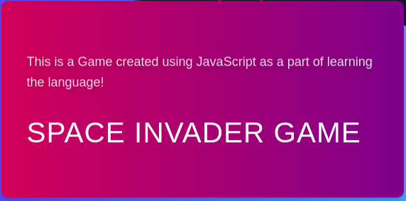
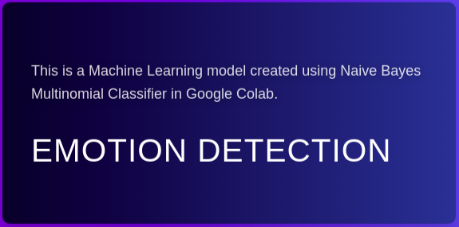

## Hi there 👋
Hello I am Raja Sekhar, a Computer Science Undergrad. Tech Enthusiast and an Author at [TechTrivan](https://techtrican.com/author/raja).
### Determinant  :pushpin: |

### Interests
  * Machine Learning
  * NLP
  * Deep Learning
  * Web Development
### My Work
* Currently working on Optical Character Recognition using OpenCV
* Previously Worked on Emotion Recognition from text
* Looking to work as an Intern

### Projects

### Contact me via
Here is my Website [Portfolio](https://rajasekhar2307.github.io/rajasekhar23071) link.
Find me on

<!--
**rajasekhar2307/rajasekhar2307** is a ✨ _special_ ✨ repository because its `README.md` (this file) appears on your GitHub profile.

Here are some ideas to get you started:

- 🔭 I’m currently working on ...
- 🌱 I’m currently learning ...
- 👯 I’m looking to collaborate on ...
- 🤔 I’m looking for help with ...
- 💬 Ask me about ...
- 📫 How to reach me: ...
- 😄 Pronouns: ...
- ⚡ Fun fact: ...
-->
